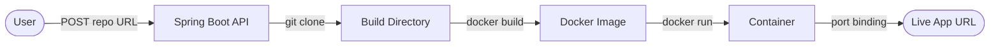
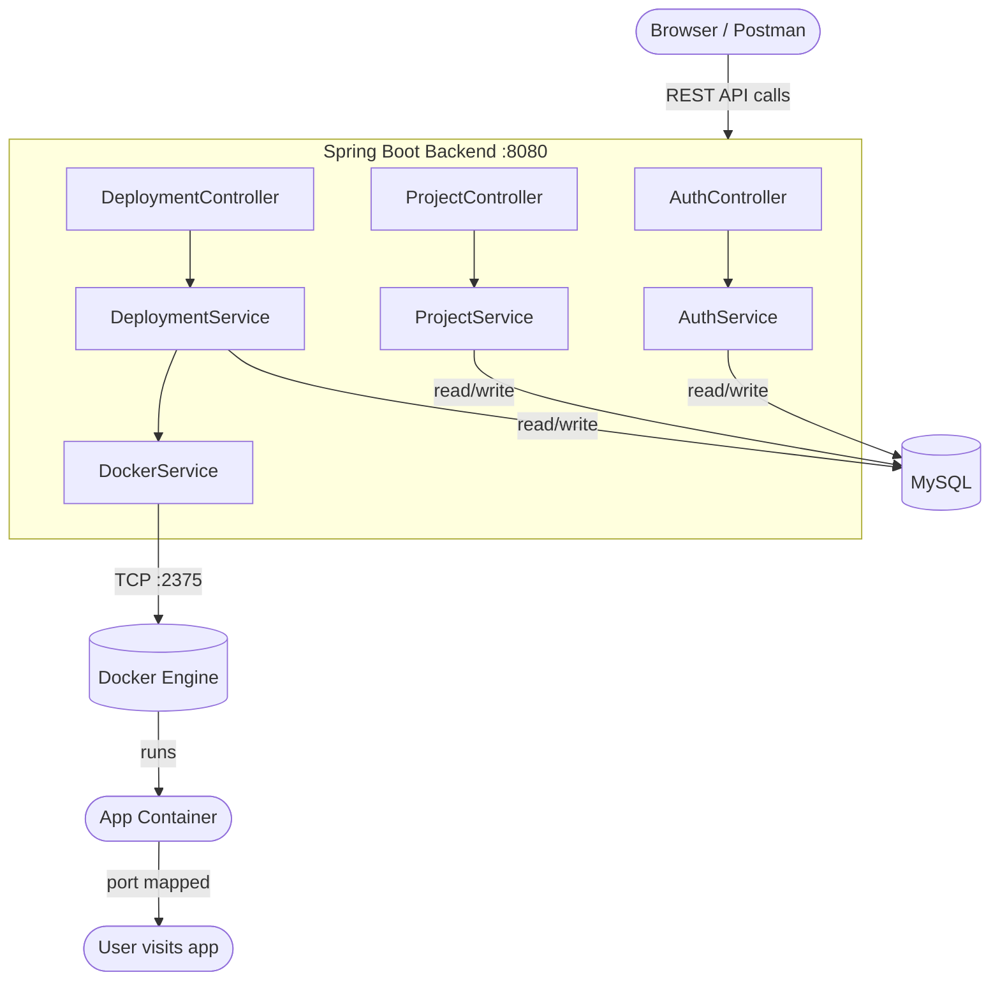
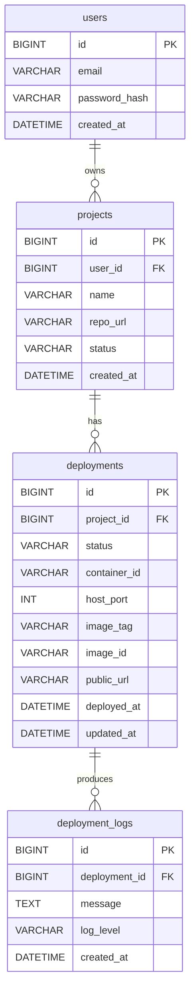
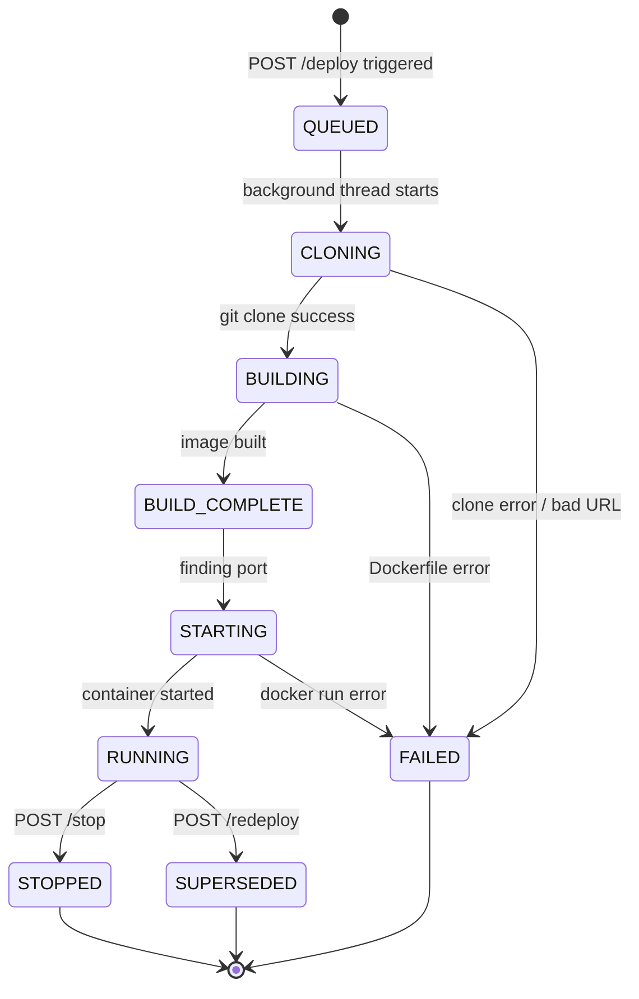
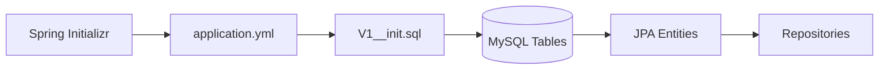
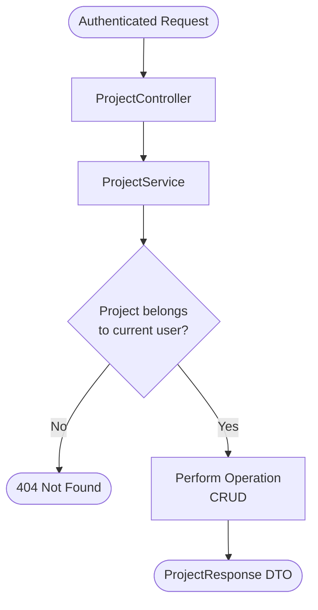

# DeploymentPlatform — Mini Heroku

A simplified Platform-as-a-Service (PaaS) system built with Java 21 and Spring Boot 3.5. It allows developers to deploy applications automatically from Git repositories — clone, build a Docker image, run a container, and expose the app through a generated URL. No manual DevOps required.

---

## What This Project Does

A user submits a GitHub repository URL. The platform takes it from there — clones the code, builds a Docker image from the Dockerfile, runs a container, assigns it a port, and makes the app accessible at a public URL. Every step is logged in real time.



---

## Tech Stack

| Layer | Technology |
|---|---|
| Language | Java 21 |
| Framework | Spring Boot 3.5.11 |
| Database | MySQL 8 |
| Migrations | Flyway |
| Containerization | Docker 29.2 via docker-java SDK 3.3.4 |
| Auth | JWT (jjwt 0.11.5) |
| Build Tool | Maven |
| Version Control | Git + GitHub |

---

## System Architecture



---

## Database Schema



---

## Deployment Pipeline Flow

```mermaid
flowchart TD
    A([POST /api/projects/id/deployments]) --> B[Save deployment - QUEUED]
    B --> C[@Async background thread starts]
    C --> D[Status → CLONING]
    D --> E{git clone success?}
    E -->|No| F[Status → FAILED\nLog error]
    E -->|Yes| G{Dockerfile exists?}
    G -->|No| F
    G -->|Yes| H[Status → BUILDING]
    H --> I[docker build image\nStream output to DB logs]
    I --> J{Build success?}
    J -->|No| F
    J -->|Yes| K[Status → BUILD_COMPLETE]
    K --> L[Status → STARTING]
    L --> M[Find available port 3000-9000]
    M --> N[docker run container\nBind host port → container 8080]
    N --> O[Save containerId + hostPort + publicUrl]
    O --> P[Status → RUNNING]
    P --> Q([App live at http://localhost:port])
```

---

## API Reference

### Auth
| Method | Endpoint | Description |
|---|---|---|
| POST | `/api/auth/register` | Register a new user |
| POST | `/api/auth/login` | Login and get JWT token |

### Projects
| Method | Endpoint | Description |
|---|---|---|
| GET | `/api/projects` | List all user's projects |
| POST | `/api/projects` | Create a new project |
| GET | `/api/projects/{id}` | Get project by ID |
| PUT | `/api/projects/{id}` | Update project |
| DELETE | `/api/projects/{id}` | Delete project |

### Deployments
| Method | Endpoint | Description |
|---|---|---|
| POST | `/api/projects/{id}/deployments` | Trigger a new deployment |
| GET | `/api/projects/{id}/deployments` | List all deployments |
| GET | `/api/projects/{id}/deployments/latest` | Get latest deployment |
| GET | `/api/projects/{id}/deployments/{depId}/logs` | Get deployment logs |
| GET | `/api/projects/{id}/deployments/{depId}/status` | Get deployment status |
| POST | `/api/projects/{id}/deployments/restart` | Restart running container |
| POST | `/api/projects/{id}/deployments/redeploy` | Full redeploy from scratch |
| POST | `/api/projects/{id}/deployments/stop` | Stop running container |

### Docker Diagnostics
| Method | Endpoint | Description |
|---|---|---|
| GET | `/api/docker/ping` | Verify Docker connection |
| GET | `/api/docker/containers` | List all containers |
| GET | `/api/docker/images` | List all images |
| GET | `/api/docker/port` | Find next free port |

---

## Deployment Status Lifecycle



---

## Project Structure

```
src/main/java/com/utkarsh/in/DeploymentPlatform/
├── config/
│   ├── AsyncConfig.java          — thread pool for async deployments
│   ├── CorsConfig.java           — CORS rules for frontend
│   ├── DockerConfig.java         — DockerClient bean
│   └── DockerProperties.java     — app.docker.* config binding
├── controller/
│   ├── AuthController.java
│   ├── DeploymentController.java
│   ├── DockerController.java
│   └── ProjectController.java
├── dto/
│   ├── request/
│   │   ├── LoginRequest.java
│   │   ├── ProjectRequest.java
│   │   └── RegisterRequest.java
│   └── response/
│       ├── AuthResponse.java
│       ├── DeploymentLogResponse.java
│       ├── DeploymentResponse.java
│       └── ProjectResponse.java
├── entity/
│   ├── Deployment.java
│   ├── DeploymentLog.java
│   ├── Project.java
│   └── User.java
├── enums/
│   └── DeploymentStatus.java
├── exception/
│   ├── AccessDeniedException.java
│   ├── ConflictException.java
│   ├── GlobalExceptionHandler.java
│   └── ResourceNotFoundException.java
├── repository/
│   ├── DeploymentLogRepository.java
│   ├── DeploymentRepository.java
│   ├── ProjectRepository.java
│   └── UserRepository.java
├── security/
│   ├── AuthUtil.java
│   ├── JwtFilter.java
│   ├── JwtUtil.java
│   └── UserDetailsServiceImpl.java
└── service/
    ├── AuthService.java
    ├── DeploymentService.java
    ├── DockerService.java
    └── ProjectService.java

src/main/resources/
├── db/migration/
│   └── V1__init.sql
└── application.yml
```

---

## Local Setup

### Prerequisites
- Java 21
- Maven 3.9+
- MySQL 8
- Docker Desktop (with TCP enabled on `localhost:2375`)
- Git

### Steps

**1. Clone the repo:**
```bash
git clone https://github.com/utkarshtiwari93/DeploymentPlatform.git
cd DeploymentPlatform
```

**2. Create the database:**
```sql
CREATE DATABASE deploymentPlatform;
```

**3. Configure `application.yml`:**
```yaml
spring:
  datasource:
    url: jdbc:mysql://localhost:3306/deploymentPlatform?useSSL=false&allowPublicKeyRetrieval=true&serverTimezone=UTC
    username: root
    password: yourpassword

app:
  jwt:
    secret: your-secret-key-minimum-32-characters
    expiration: 86400000
  docker:
    socket-path: tcp://localhost:2375
    build-dir: C:/tmp/deployments
```

**4. Enable Docker TCP** — Docker Desktop → Settings → General → check `Expose daemon on tcp://localhost:2375`

**5. Run:**
```bash
./mvnw spring-boot:run
```

Flyway will auto-create all tables on first startup.

---

## How to Deploy Your First App

Your repository must have a `Dockerfile` at the root that exposes port `8080`.

**Example Dockerfile:**
```dockerfile
FROM node:18-alpine
WORKDIR /app
COPY app.js .
EXPOSE 8080
CMD ["node", "app.js"]
```

**Step 1 — Register:**
```bash
curl -X POST http://localhost:8080/api/auth/register \
  -H "Content-Type: application/json" \
  -d '{"email":"you@email.com","password":"secret123"}'
```

**Step 2 — Create project:**
```bash
curl -X POST http://localhost:8080/api/projects \
  -H "Authorization: Bearer <token>" \
  -H "Content-Type: application/json" \
  -d '{"name":"My App","repoUrl":"https://github.com/you/your-repo"}'
```

**Step 3 — Deploy:**
```bash
curl -X POST http://localhost:8080/api/projects/1/deployments \
  -H "Authorization: Bearer <token>"
```

**Step 4 — Poll until RUNNING:**
```bash
curl http://localhost:8080/api/projects/1/deployments/latest \
  -H "Authorization: Bearer <token>"
```

**Step 5 — Visit your app at the `publicUrl` in the response.**

---

## Build Progress — Day by Day

---

### Day 1 — Project Scaffold & Database Schema

Set up the Spring Boot project from scratch using Spring Initializr with Java 21. Designed the full MySQL schema with four tables and proper foreign key constraints. Created all JPA entity classes and repository interfaces. Configured Flyway for automatic migrations.



**What was built:** `User`, `Project`, `Deployment`, `DeploymentLog` entities + repositories + Flyway migration.

---

### Day 2 — JWT Authentication

Implemented stateless JWT-based authentication. Users can register and login — both return a signed JWT token. A `JwtFilter` intercepts every request, validates the token, and sets the Spring Security context. All routes except `/api/auth/**` are protected.


**What was built:** `JwtUtil`, `JwtFilter`, `SecurityConfig`, `AuthService`, `AuthController`, `UserDetailsServiceImpl`.

---

### Day 3 — Project Management API

Built full CRUD for projects with strict ownership enforcement — users can only see and modify their own projects. Added a global exception handler covering 400, 403, 404, 409 responses. Added CORS config for frontend integration.



**What was built:** `ProjectController`, `ProjectService`, `ProjectRequest`, `ProjectResponse`, `AuthUtil`, `GlobalExceptionHandler`, `CorsConfig`.

---

### Day 4 — Docker Java SDK Integration

Connected Spring Boot to the local Docker engine using the docker-java SDK over TCP (`localhost:2375`). Verified the connection on startup with a `@PostConstruct` check that logs Docker version and container count. Built port scanning logic to find the next available host port.

```mermaid
flowchart LR
    A[Spring Boot Start] --> B[@PostConstruct\nverifyDockerConnection]
    B --> C{TCP :2375\nreachable?}
    C -->|No| D([App fails to start\nDocker not running])
    C -->|Yes| E[Log Docker version\ncontainer count]
    E --> F([App starts normally])
```

**What was built:** `DockerConfig`, `DockerService` (connect, list containers, list images, find free port, pull image, remove image), `DockerProperties`, `DockerController`.

**Key fix:** Spring Boot 3.5.x ships `httpclient5 5.4.x` which conflicted with docker-java. Fixed by explicitly declaring `httpclient5 5.4.1`, `httpcore5 5.3.3`, `httpcore5-h2 5.3.3` and excluding the transitive versions from docker-java.

---

### Day 5 — Git Clone & Docker Build Pipeline

Built the async deployment engine. Calling `POST /deploy` returns `202 Accepted` immediately while a background thread runs the full pipeline — git clone → Dockerfile validation → docker build — saving every output line to the `deployment_logs` table in real time.


**What was built:** `DeploymentService` (full async pipeline), `DeploymentController`, `AsyncConfig` (thread pool), `DeploymentResponse`, `DeploymentLogResponse`.

**Tested with:** Public GitHub repo containing `app.js` + `Dockerfile` (Node.js hello-world on port 8080). Result: `BUILD_COMPLETE` with image `ec5b23e60a6f`.

---

### Day 6 — Container Lifecycle Management

Extended the pipeline to go all the way to `RUNNING`. After a successful build, the platform finds an available host port, runs the container with port binding, saves the `containerId`, `hostPort`, and `publicUrl` to the deployment record, and marks the project `ACTIVE`. Added restart, stop, and full redeploy flows.


**What was built:** `DockerService.runContainer`, `stopContainer`, `removeContainer`, `restartContainer` + `DeploymentService.restartDeployment`, `redeployProject`, `stopDeployment` + three new controller endpoints.

---

# AutoDeploy — Days 7 to 15

> Append this to your existing README.md after Day 6.

---

## Day 7 — SSE Log Streaming

**Goal:** Stream build logs in real time to the client using Server-Sent Events.

### What was built
- `LogStreamService` — polls `deployment_logs` table every 500ms, pushes new rows as SSE events
- `LogStreamController` — `GET /api/projects/{id}/deployments/{depId}/logs/stream`
- Resume support via `Last-Event-ID` header — reconnecting clients don't miss logs
- Event types: `log`, `status`, `error`, `timeout`
- Stream closes automatically when deployment reaches terminal state (`RUNNING`, `FAILED`, `STOPPED`, `SUPERSEDED`)
- `DelegatingSecurityContextAsyncTaskExecutor` — propagates Spring Security context to async SSE threads

### Key fix
Spring Security blocked SSE async dispatches with `Access Denied`. Fixed by adding `dispatcherTypeMatchers(ASYNC, ERROR).permitAll()` in `SecurityConfig`.

### SSE Event format
```
id: 42
event: log
data: [INFO] Step 1/5 : FROM node:18-alpine

event: status
data: RUNNING
```

### API
```
GET /api/projects/{projectId}/deployments/{deploymentId}/logs/stream
Authorization: Bearer <token>
Headers: Last-Event-ID: 0
```

---

## Day 8 — Nginx Reverse Proxy Automation

**Goal:** Auto-generate Nginx config files per deployment so each app gets a clean URL.

### What was built
- `NginxProperties` — config binding for `app.nginx.*`
- `NginxService`:
  - `createProxyConfig(deploymentId, hostPort)` — writes config to `sites-available`, creates symlink in `sites-enabled`, reloads Nginx
  - `removeProxyConfig(deploymentId)` — removes config and symlink, reloads Nginx
  - `buildPublicUrl(deploymentId)` — returns `http://app-{id}.{domain}`
  - `buildServerName(deploymentId)` — returns `app-{id}.{domain}`
- Hooked into `DeploymentService` — called after container starts and on stop/redeploy/delete
- Windows-safe flag `app.nginx.enabled: false` — skips actual file writes locally, logs `[Nginx DISABLED]`

### Generated Nginx config (per deployment)
```nginx
server {
    listen 80;
    server_name app-8.yourdomain.com;

    location / {
        proxy_pass http://127.0.0.1:3004;
        proxy_http_version 1.1;
        proxy_set_header Upgrade $http_upgrade;
        proxy_set_header Connection 'upgrade';
        proxy_set_header Host $host;
        proxy_cache_bypass $http_upgrade;
        proxy_read_timeout 300s;
    }
}
```

### Config
```yaml
app:
  nginx:
    enabled: false              # true on production VPS
    sites-available: /etc/nginx/sites-available
    sites-enabled: /etc/nginx/sites-enabled
    domain-suffix: localhost
    nginx-reload-command: nginx -s reload
```

### API
```
GET /api/docker/nginx/preview/{deploymentId}/{port}
```

---

## Day 9 — Cleanup Scheduler & Lifecycle Polish

**Goal:** Auto-clean old containers, images, and build directories on a schedule.

### What was built
- `CleanupProperties` — config binding for `app.cleanup.*`
- `CleanupScheduler`:
  - `runHourlyCleanup()` — `@Scheduled(cron = "0 0 * * * *")` — removes old `FAILED`, `SUPERSEDED`, `STOPPED` deployments older than `retention-days`
  - `runDailyImagePrune()` — `@Scheduled(cron = "0 0 0 * * *")` — prunes old Docker images
  - `cleanupOrphanedBuildDirs()` — removes leftover `C:/tmp/deployments/{id}` dirs for non-existent deployments
  - `cleanupSingleDeployment(deployment)` — stops container, removes container, removes image, removes Nginx config
  - `onShutdown()` — `@PreDestroy` graceful shutdown log
- Updated `ProjectService.deleteProject` — full cascade: stops all containers, removes all images, removes all Nginx configs before deleting project from DB
- Added `@EnableScheduling` to main application class

### Config
```yaml
app:
  cleanup:
    enabled: true
    retention-days: 7
    build-dir: C:/tmp/deployments
```

### API
```
POST /api/docker/cleanup/run    ← manual trigger for testing
```

### DeploymentRepository queries added
```java
findOldDeploymentsByStatuses(statuses, cutoff)
findAllRunningDeployments()
findByProjectId(projectId)
```

---

## Day 10 — Full End-to-End Integration Testing

**Goal:** Manually test every single backend flow before building the frontend.

### Test flows covered

| Flow | Endpoint | Expected |
|---|---|---|
| Register | POST /api/auth/register | 200 + token |
| Duplicate email | POST /api/auth/register | 409 Conflict |
| Login | POST /api/auth/login | 200 + token |
| Wrong password | POST /api/auth/login | 401 Unauthorized |
| No token | GET /api/projects | 403 Forbidden |
| Create project | POST /api/projects | 201 Created |
| Invalid repo URL | POST /api/projects | 400 Bad Request |
| Cross-user access | GET /api/projects/{id} | 404 Not Found |
| Trigger deploy | POST /api/projects/{id}/deployments | 202 Accepted |
| SSE stream | GET .../logs/stream | Live log events |
| Duplicate deploy | POST /api/projects/{id}/deployments | 409 Conflict |
| Stop deployment | POST .../stop | 200, status STOPPED |
| Restart | POST .../restart | 200, container restarts |
| Redeploy | POST .../redeploy | Old SUPERSEDED, new RUNNING |
| Delete project | DELETE /api/projects/{id} | 204, container removed |
| Manual cleanup | POST /api/docker/cleanup/run | 200, logs show cleanup |

### All tests passed ✅

---

## Day 11 — React Frontend Scaffold

**Goal:** Set up the React frontend with auth, routing, and protected routes.

### Tech stack
- **Vite + React 18** — fast dev server
- **Tailwind CSS** — utility-first styling
- **React Router v6** — client-side routing
- **Axios** — HTTP client with interceptors
- **Context API** — global auth state

### Project structure
```
src/
├── api/
│   └── axios.js              # Axios instance + interceptors
├── context/
│   └── AuthContext.jsx       # Auth state, login, register, logout
├── components/
│   └── ProtectedRoute.jsx    # Redirects to /login if no token
├── pages/
│   ├── Login.jsx
│   ├── Register.jsx
│   └── Dashboard.jsx         # Stub for Day 12
├── App.jsx                   # BrowserRouter + Routes
└── main.jsx
```

### Auth flow
```
Login → JWT stored in localStorage → Axios attaches Bearer token to every request
403/401 response → clear localStorage → redirect to /login
```

### Features
- JWT token persisted in `localStorage`
- Axios request interceptor auto-attaches `Authorization: Bearer <token>`
- Axios response interceptor handles 401/403 — auto logout + redirect
- `ProtectedRoute` redirects unauthenticated users to `/login`
- Dark theme (`#0f172a` background)

---

## Day 12 — Dashboard & Project Management UI

**Goal:** Build the full dashboard with project list, status badges, actions, and project detail page.

### Pages built

#### Dashboard (`/dashboard`)
- Stats grid — total projects, running count, failed count
- Projects list with real-time status polling every 5 seconds
- `StatusBadge` component — color-coded per status
- `NewProjectModal` — create project with name + repo URL
- Per-project actions: Deploy, Stop, Restart, Redeploy, Delete
- Actions disabled/shown based on current deployment status
- Clickable project name → navigates to project detail

#### Project Detail (`/projects/:id`)
- Deployment info panel — status, public URL, port, image tag, deployed at
- Repository info panel
- Action buttons — Deploy, Stop, Restart, Redeploy, View live logs
- Deployment history table — all deployments with status, image tag, port, timestamp, logs link
- Auto-refreshes every 5 seconds

### Status badge colors
| Status | Color |
|---|---|
| RUNNING | Green |
| BUILDING / CLONING / STARTING | Blue |
| QUEUED | Gray |
| FAILED | Red |
| STOPPED / SUPERSEDED | Gray |

---

## Day 13 — Live Log Viewer

**Goal:** Real-time build log streaming in the browser using SSE.

### Page built

#### LogViewer (`/projects/:id/deployments/:deploymentId/logs`)
- Connects to Spring Boot SSE endpoint via `fetch()` + `ReadableStream`
- Parses SSE event stream manually (EventSource API doesn't support custom headers)
- Logs appear line by line in real time
- Color-coded log lines:
  - `[INFO]` → gray
  - `[ERROR]` → red
  - `[WARN]` → yellow
  - `successfully` / `Successfully` → green
  - Docker steps (`Step X/Y`) → blue
  - Dockerfile keywords (`FROM`, `RUN`, `COPY`, `WORKDIR`) → purple
- Blinking cursor while stream is live
- Auto-scroll to bottom as logs arrive
- Manual scroll up → auto-scroll pauses
- `Auto-scroll` toggle button
- Live indicator with green pulsing dot
- Terminal success message with app URL when `RUNNING`
- Terminal failure message when `FAILED`
- Stats bar — line count, image tag, port

### SSE parsing approach
```js
fetch(url, { headers: { Authorization: `Bearer ${token}` } })
  .then(res => res.body.getReader())
  // parse event:, data:, id: lines manually
  // dispatch to state
```

---

## Day 14 — Error Handling & Final Polish

**Goal:** Production-quality error handling, toast notifications, and UX improvements.

### Frontend changes

#### Toast notification system (`src/components/Toast.jsx`)
- `ToastProvider` wraps entire app
- `useToast()` hook — `addToast(message, type)` from any component
- Types: `success` (green), `error` (red), `info` (blue), `warning` (yellow)
- Auto-dismiss after 4 seconds
- Manual dismiss via ✕ button
- Fixed bottom-right position

#### 404 page (`src/pages/NotFound.jsx`)
- Clean 404 page with back to dashboard button
- Catches all unknown routes via `path="*"`

#### Other improvements
- Replaced all `alert()` calls with proper toast notifications
- Page titles via `document.title` on each page
- Root `/` redirects to `/dashboard`
- JWT expiry handling — 401 triggers auto logout + redirect to login

### Backend changes

#### GlobalExceptionHandler improvements
- Added `IllegalArgumentException` handler → 400
- Added generic `Exception` handler → 500 with logging
- All handlers return consistent `{ "error": "message" }` JSON
- Null-safe message handling throughout
- Proper logging with `@Slf4j` on all error paths

---

## Day 15 — Production Deployment

**Goal:** Deploy the full platform to a Linux VPS.

### Server setup (Ubuntu 22.04)

```bash
# Install Java 21
sudo apt install -y openjdk-21-jdk

# Install Docker
curl -fsSL https://get.docker.com | sh
sudo usermod -aG docker $USER

# Install MySQL
sudo apt install -y mysql-server
sudo mysql_secure_installation

# Install Nginx
sudo apt install -y nginx

# Install Node.js (for frontend build)
curl -fsSL https://deb.nodesource.com/setup_18.x | sudo -E bash -
sudo apt install -y nodejs
```

### Backend deployment

```bash
# Build JAR
./mvnw clean package -DskipTests

# Copy to server
scp target/DeploymentPlatform-0.0.1-SNAPSHOT.jar user@your-vps:/opt/autodeploy/

# Create systemd service
sudo nano /etc/systemd/system/autodeploy.service
```

```ini
[Unit]
Description=AutoDeploy Backend
After=network.target mysql.service

[Service]
Type=simple
User=ubuntu
WorkingDirectory=/opt/autodeploy
ExecStart=/usr/bin/java -jar DeploymentPlatform-0.0.1-SNAPSHOT.jar
Restart=on-failure
Environment="SPRING_PROFILES_ACTIVE=prod"

[Install]
WantedBy=multi-user.target
```

```bash
sudo systemctl enable autodeploy
sudo systemctl start autodeploy
sudo systemctl status autodeploy
```

### Frontend deployment

```bash
# Build frontend
npm run build

# Copy dist to server
scp -r dist/ user@your-vps:/var/www/autodeploy/

# Nginx config for frontend
sudo nano /etc/nginx/sites-available/autodeploy
```

```nginx
server {
    listen 80;
    server_name your-domain.com;
    root /var/www/autodeploy;
    index index.html;

    location / {
        try_files $uri $uri/ /index.html;
    }

    location /api {
        proxy_pass http://localhost:8080;
        proxy_set_header Host $host;
        proxy_set_header X-Real-IP $remote_addr;
        proxy_set_header X-Forwarded-For $proxy_add_x_forwarded_for;
    }
}
```

```bash
sudo ln -s /etc/nginx/sites-available/autodeploy /etc/nginx/sites-enabled/
sudo nginx -t
sudo systemctl reload nginx
```

### Production application.yml changes

```yaml
app:
  nginx:
    enabled: true                        # flip to true
    domain-suffix: your-domain.com       # your actual domain
    nginx-reload-command: sudo nginx -s reload

  docker:
    socket-path: unix:///var/run/docker.sock   # Linux socket
    build-dir: /tmp/deployments

  cleanup:
    build-dir: /tmp/deployments
```

### Update frontend API base URL

In `src/api/axios.js` change:
```js
baseURL: 'https://your-domain.com/api'
```

---

## Complete API Reference

### Auth
| Method | Endpoint | Auth | Description |
|---|---|---|---|
| POST | /api/auth/register | No | Register new user |
| POST | /api/auth/login | No | Login, returns JWT |

### Projects
| Method | Endpoint | Auth | Description |
|---|---|---|---|
| GET | /api/projects | Yes | Get all user projects |
| GET | /api/projects/{id} | Yes | Get project by ID |
| POST | /api/projects | Yes | Create project |
| PUT | /api/projects/{id} | Yes | Update project |
| DELETE | /api/projects/{id} | Yes | Delete project + cleanup |

### Deployments
| Method | Endpoint | Auth | Description |
|---|---|---|---|
| POST | /api/projects/{id}/deployments | Yes | Trigger deployment |
| GET | /api/projects/{id}/deployments | Yes | Get all deployments |
| GET | /api/projects/{id}/deployments/latest | Yes | Get latest deployment |
| GET | /api/projects/{id}/deployments/{depId}/logs | Yes | Get logs |
| GET | /api/projects/{id}/deployments/{depId}/logs/stream | Yes | SSE live stream |
| POST | /api/projects/{id}/deployments/stop | Yes | Stop deployment |
| POST | /api/projects/{id}/deployments/restart | Yes | Restart container |
| POST | /api/projects/{id}/deployments/redeploy | Yes | Full redeploy |

### Docker & Admin
| Method | Endpoint | Auth | Description |
|---|---|---|---|
| GET | /api/docker/ping | Yes | Docker health check |
| GET | /api/docker/containers | Yes | List containers |
| GET | /api/docker/images | Yes | List images |
| GET | /api/docker/nginx/preview/{id}/{port} | Yes | Preview Nginx config |
| POST | /api/docker/cleanup/run | Yes | Manual cleanup trigger |

---

## Deployment Requirements

Any app deployed through AutoDeploy must meet these requirements:

| Requirement | Details |
|---|---|
| Public repository | GitHub, GitLab, or Bitbucket HTTPS URL only |
| Dockerfile in root | Must exist at repo root — not in a subdirectory |
| Port 8080 | App must listen on port 8080 inside the container |
| No auth required | Repo must be cloneable without credentials |

### Example Dockerfile (Node.js)
```dockerfile
FROM node:18-alpine
WORKDIR /app
COPY package*.json .
RUN npm install
COPY . .
EXPOSE 8080
CMD ["node", "app.js"]
```

### Example Dockerfile (Python Flask)
```dockerfile
FROM python:3.11-alpine
WORKDIR /app
COPY requirements.txt .
RUN pip install -r requirements.txt
COPY . .
EXPOSE 8080
CMD ["python", "app.py"]
```

### Example Dockerfile (React frontend)
```dockerfile
FROM node:18-alpine AS builder
WORKDIR /app
COPY package*.json .
RUN npm install
COPY . .
RUN npm run build

FROM nginx:alpine
COPY --from=builder /app/dist /usr/share/nginx/html
COPY nginx.conf /etc/nginx/conf.d/default.conf
EXPOSE 8080
CMD ["nginx", "-g", "daemon off;"]
```

## Known Limitations

- Requires a `Dockerfile` at the repository root — no auto-detection of language/buildpacks
- Container must listen on port `8080` internally — this is a platform convention
- No HTTPS on generated URLs — plain HTTP only
- No resource limits on containers — memory and CPU are uncapped
- Public repos only — private GitHub repos require SSH key setup

---

## Author

Built by Utkarsh as a 15-day backend engineering project demonstrating containerization, Docker programmatic control, JWT auth, async pipelines, and REST API design.
