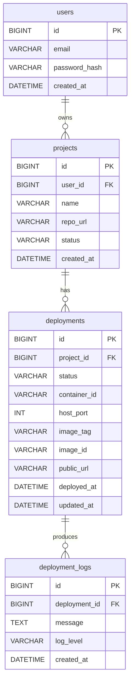
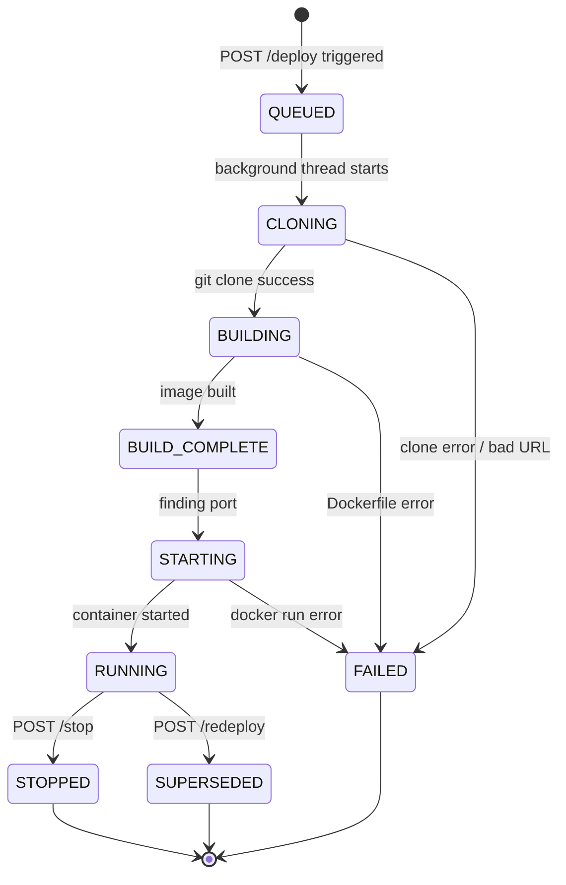
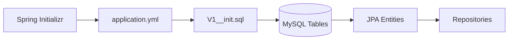
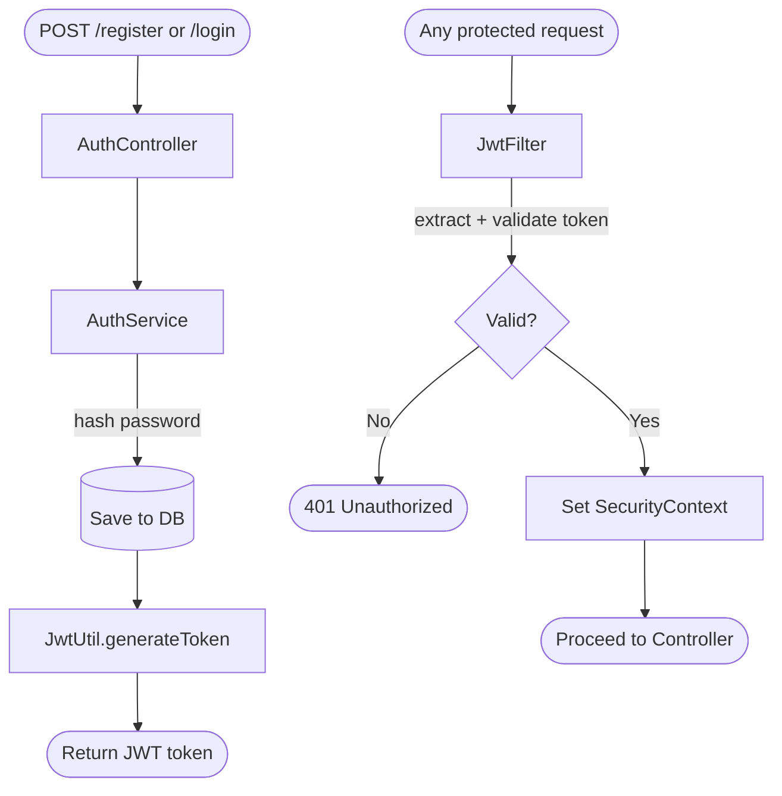
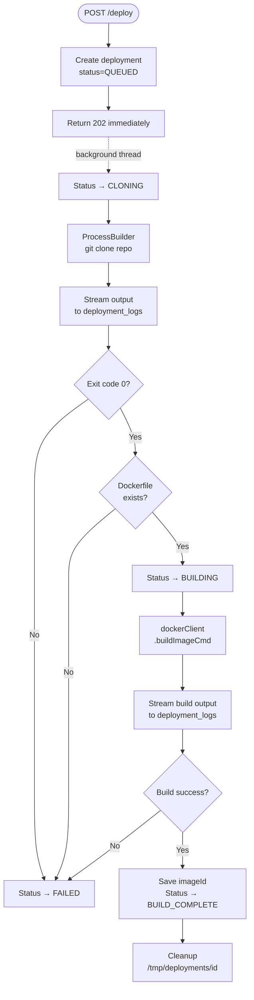
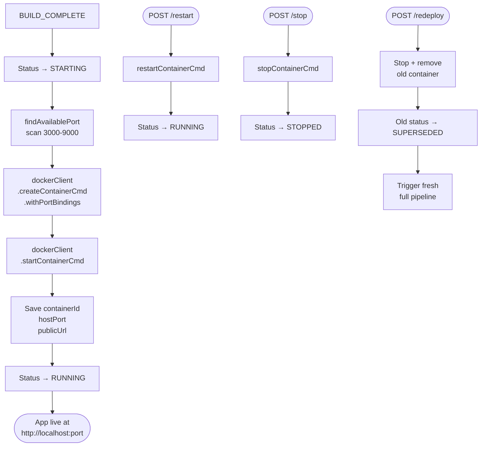

# DeploymentPlatform — Mini Heroku

A simplified Platform-as-a-Service (PaaS) system built with Java 21 and Spring Boot 3.5. It allows developers to deploy applications automatically from Git repositories — clone, build a Docker image, run a container, and expose the app through a generated URL. No manual DevOps required.

---

## What This Project Does

A user submits a GitHub repository URL. The platform takes it from there — clones the code, builds a Docker image from the Dockerfile, runs a container, assigns it a port, and makes the app accessible at a public URL. Every step is logged in real time.


---

## Tech Stack

| Layer | Technology |
|---|---|
| Language | Java 21 |
| Framework | Spring Boot 3.5.11 |
| Database | MySQL 8 |
| Migrations | Flyway |
| Containerization | Docker 29.2 via docker-java SDK 3.3.4 |
| Auth | JWT (jjwt 0.11.5) |
| Build Tool | Maven |
| Version Control | Git + GitHub |

---

## System Architecture


---

## Database Schema



---

## Deployment Pipeline Flow

```mermaid
flowchart TD
    A([POST /api/projects/id/deployments]) --> B[Save deployment - QUEUED]
    B --> C[@Async background thread starts]
    C --> D[Status → CLONING]
    D --> E{git clone success?}
    E -->|No| F[Status → FAILED\nLog error]
    E -->|Yes| G{Dockerfile exists?}
    G -->|No| F
    G -->|Yes| H[Status → BUILDING]
    H --> I[docker build image\nStream output to DB logs]
    I --> J{Build success?}
    J -->|No| F
    J -->|Yes| K[Status → BUILD_COMPLETE]
    K --> L[Status → STARTING]
    L --> M[Find available port 3000-9000]
    M --> N[docker run container\nBind host port → container 8080]
    N --> O[Save containerId + hostPort + publicUrl]
    O --> P[Status → RUNNING]
    P --> Q([App live at http://localhost:port])
```

---

## API Reference

### Auth
| Method | Endpoint | Description |
|---|---|---|
| POST | `/api/auth/register` | Register a new user |
| POST | `/api/auth/login` | Login and get JWT token |

### Projects
| Method | Endpoint | Description |
|---|---|---|
| GET | `/api/projects` | List all user's projects |
| POST | `/api/projects` | Create a new project |
| GET | `/api/projects/{id}` | Get project by ID |
| PUT | `/api/projects/{id}` | Update project |
| DELETE | `/api/projects/{id}` | Delete project |

### Deployments
| Method | Endpoint | Description |
|---|---|---|
| POST | `/api/projects/{id}/deployments` | Trigger a new deployment |
| GET | `/api/projects/{id}/deployments` | List all deployments |
| GET | `/api/projects/{id}/deployments/latest` | Get latest deployment |
| GET | `/api/projects/{id}/deployments/{depId}/logs` | Get deployment logs |
| GET | `/api/projects/{id}/deployments/{depId}/status` | Get deployment status |
| POST | `/api/projects/{id}/deployments/restart` | Restart running container |
| POST | `/api/projects/{id}/deployments/redeploy` | Full redeploy from scratch |
| POST | `/api/projects/{id}/deployments/stop` | Stop running container |

### Docker Diagnostics
| Method | Endpoint | Description |
|---|---|---|
| GET | `/api/docker/ping` | Verify Docker connection |
| GET | `/api/docker/containers` | List all containers |
| GET | `/api/docker/images` | List all images |
| GET | `/api/docker/port` | Find next free port |

---

## Deployment Status Lifecycle



---

## Project Structure

```
src/main/java/com/utkarsh/in/DeploymentPlatform/
├── config/
│   ├── AsyncConfig.java          — thread pool for async deployments
│   ├── CorsConfig.java           — CORS rules for frontend
│   ├── DockerConfig.java         — DockerClient bean
│   └── DockerProperties.java     — app.docker.* config binding
├── controller/
│   ├── AuthController.java
│   ├── DeploymentController.java
│   ├── DockerController.java
│   └── ProjectController.java
├── dto/
│   ├── request/
│   │   ├── LoginRequest.java
│   │   ├── ProjectRequest.java
│   │   └── RegisterRequest.java
│   └── response/
│       ├── AuthResponse.java
│       ├── DeploymentLogResponse.java
│       ├── DeploymentResponse.java
│       └── ProjectResponse.java
├── entity/
│   ├── Deployment.java
│   ├── DeploymentLog.java
│   ├── Project.java
│   └── User.java
├── enums/
│   └── DeploymentStatus.java
├── exception/
│   ├── AccessDeniedException.java
│   ├── ConflictException.java
│   ├── GlobalExceptionHandler.java
│   └── ResourceNotFoundException.java
├── repository/
│   ├── DeploymentLogRepository.java
│   ├── DeploymentRepository.java
│   ├── ProjectRepository.java
│   └── UserRepository.java
├── security/
│   ├── AuthUtil.java
│   ├── JwtFilter.java
│   ├── JwtUtil.java
│   └── UserDetailsServiceImpl.java
└── service/
    ├── AuthService.java
    ├── DeploymentService.java
    ├── DockerService.java
    └── ProjectService.java

src/main/resources/
├── db/migration/
│   └── V1__init.sql
└── application.yml
```

---

## Local Setup

### Prerequisites
- Java 21
- Maven 3.9+
- MySQL 8
- Docker Desktop (with TCP enabled on `localhost:2375`)
- Git

### Steps

**1. Clone the repo:**
```bash
git clone https://github.com/utkarshtiwari93/DeploymentPlatform.git
cd DeploymentPlatform
```

**2. Create the database:**
```sql
CREATE DATABASE deploymentPlatform;
```

**3. Configure `application.yml`:**
```yaml
spring:
  datasource:
    url: jdbc:mysql://localhost:3306/deploymentPlatform?useSSL=false&allowPublicKeyRetrieval=true&serverTimezone=UTC
    username: root
    password: yourpassword

app:
  jwt:
    secret: your-secret-key-minimum-32-characters
    expiration: 86400000
  docker:
    socket-path: tcp://localhost:2375
    build-dir: C:/tmp/deployments
```

**4. Enable Docker TCP** — Docker Desktop → Settings → General → check `Expose daemon on tcp://localhost:2375`

**5. Run:**
```bash
./mvnw spring-boot:run
```

Flyway will auto-create all tables on first startup.

---

## How to Deploy Your First App

Your repository must have a `Dockerfile` at the root that exposes port `8080`.

**Example Dockerfile:**
```dockerfile
FROM node:18-alpine
WORKDIR /app
COPY app.js .
EXPOSE 8080
CMD ["node", "app.js"]
```

**Step 1 — Register:**
```bash
curl -X POST http://localhost:8080/api/auth/register \
  -H "Content-Type: application/json" \
  -d '{"email":"you@email.com","password":"secret123"}'
```

**Step 2 — Create project:**
```bash
curl -X POST http://localhost:8080/api/projects \
  -H "Authorization: Bearer <token>" \
  -H "Content-Type: application/json" \
  -d '{"name":"My App","repoUrl":"https://github.com/you/your-repo"}'
```

**Step 3 — Deploy:**
```bash
curl -X POST http://localhost:8080/api/projects/1/deployments \
  -H "Authorization: Bearer <token>"
```

**Step 4 — Poll until RUNNING:**
```bash
curl http://localhost:8080/api/projects/1/deployments/latest \
  -H "Authorization: Bearer <token>"
```

**Step 5 — Visit your app at the `publicUrl` in the response.**

---

## Build Progress — Day by Day

---

### Day 1 — Project Scaffold & Database Schema

Set up the Spring Boot project from scratch using Spring Initializr with Java 21. Designed the full MySQL schema with four tables and proper foreign key constraints. Created all JPA entity classes and repository interfaces. Configured Flyway for automatic migrations.



**What was built:** `User`, `Project`, `Deployment`, `DeploymentLog` entities + repositories + Flyway migration.

---

### Day 2 — JWT Authentication

Implemented stateless JWT-based authentication. Users can register and login — both return a signed JWT token. A `JwtFilter` intercepts every request, validates the token, and sets the Spring Security context. All routes except `/api/auth/**` are protected.



**What was built:** `JwtUtil`, `JwtFilter`, `SecurityConfig`, `AuthService`, `AuthController`, `UserDetailsServiceImpl`.

---

### Day 3 — Project Management API

Built full CRUD for projects with strict ownership enforcement — users can only see and modify their own projects. Added a global exception handler covering 400, 403, 404, 409 responses. Added CORS config for frontend integration.


**What was built:** `ProjectController`, `ProjectService`, `ProjectRequest`, `ProjectResponse`, `AuthUtil`, `GlobalExceptionHandler`, `CorsConfig`.

---

### Day 4 — Docker Java SDK Integration

Connected Spring Boot to the local Docker engine using the docker-java SDK over TCP (`localhost:2375`). Verified the connection on startup with a `@PostConstruct` check that logs Docker version and container count. Built port scanning logic to find the next available host port.

```mermaid
flowchart LR
    A[Spring Boot Start] --> B[@PostConstruct\nverifyDockerConnection]
    B --> C{TCP :2375\nreachable?}
    C -->|No| D([App fails to start\nDocker not running])
    C -->|Yes| E[Log Docker version\ncontainer count]
    E --> F([App starts normally])
```

**What was built:** `DockerConfig`, `DockerService` (connect, list containers, list images, find free port, pull image, remove image), `DockerProperties`, `DockerController`.

**Key fix:** Spring Boot 3.5.x ships `httpclient5 5.4.x` which conflicted with docker-java. Fixed by explicitly declaring `httpclient5 5.4.1`, `httpcore5 5.3.3`, `httpcore5-h2 5.3.3` and excluding the transitive versions from docker-java.

---

### Day 5 — Git Clone & Docker Build Pipeline

Built the async deployment engine. Calling `POST /deploy` returns `202 Accepted` immediately while a background thread runs the full pipeline — git clone → Dockerfile validation → docker build — saving every output line to the `deployment_logs` table in real time.



**What was built:** `DeploymentService` (full async pipeline), `DeploymentController`, `AsyncConfig` (thread pool), `DeploymentResponse`, `DeploymentLogResponse`.

**Tested with:** Public GitHub repo containing `app.js` + `Dockerfile` (Node.js hello-world on port 8080). Result: `BUILD_COMPLETE` with image `ec5b23e60a6f`.

---

### Day 6 — Container Lifecycle Management

Extended the pipeline to go all the way to `RUNNING`. After a successful build, the platform finds an available host port, runs the container with port binding, saves the `containerId`, `hostPort`, and `publicUrl` to the deployment record, and marks the project `ACTIVE`. Added restart, stop, and full redeploy flows.



**What was built:** `DockerService.runContainer`, `stopContainer`, `removeContainer`, `restartContainer` + `DeploymentService.restartDeployment`, `redeployProject`, `stopDeployment` + three new controller endpoints.

---

## Known Limitations

- Requires a `Dockerfile` at the repository root — no auto-detection of language/buildpacks
- Container must listen on port `8080` internally — this is a platform convention
- No HTTPS on generated URLs — plain HTTP only
- No resource limits on containers — memory and CPU are uncapped
- Public repos only — private GitHub repos require SSH key setup

---

## Author

Built by Utkarsh as a 15-day backend engineering project demonstrating containerization, Docker programmatic control, JWT auth, async pipelines, and REST API design.
